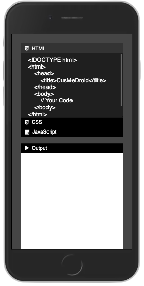
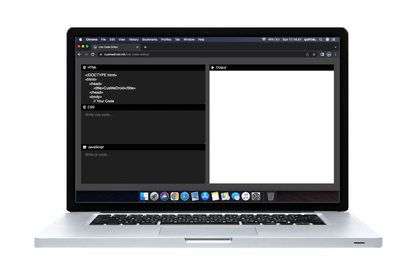

# Live Code Editor
This is live code editor (HTML, CSS &amp; JS)

My goal is to make a live code editor to make it easier for beginners who want to make page website by writing code. If you are used to creating web views by writing code, this is the place to write and display the results you write.

# Knowing Code Tag

``` html
<!DOCTYPE html>
<html>
  <head>
    <title>Website name</title>
  </head>
  <body>
    <h1>Heading</h1>
    <h2>Subheading</h2>
    <p>Paragraph</p>
    <a href="https://yourlink.com">Your Link</a>
    <button>Button</button>
    <div>Divider</div>
  </body>
</html>
```

# Screenshoot

1. > Responsive Style

[](https://cusmedroid.github.io/live-code-editor)


2. > In Phone Interface

[](https://cusmedroid.github.io/live-code-editor)


3. > In Computer/Laptop Interface

[](https://cusmedroid.github.io/live-code-editor)


