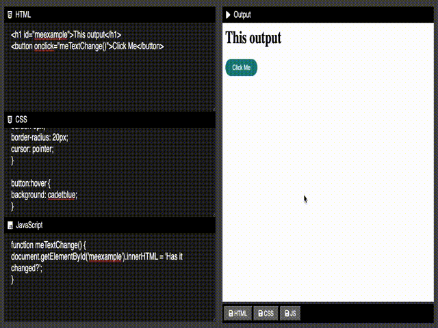

# Live Code Editor (LCE)
This is live code editor (HTML, CSS &amp; JS)

My goal is to make a live code editor to make it easier for beginners who want to make page website by writing code. If you are used to creating web views by writing code, this is the place to write and display the results you write.

Realese/publish on Website v1.0

Changelog :
```
  1. Minimalist UI/UX
  2. Logic sistem input to output
  3. Saving data to local dir
```
# Screenshoot (SS) | LCE
> Responsive Style

[](https://cusmedroid.github.io/live-code-editor)


# SS image raw phone/tablet/computer | LCE

[](https://cusmedroid.github.io/live-code-editor) [](https://cusmedroid.github.io/live-code-editor)

# Knowing Code Tag HTML
``` html
<!DOCTYPE html>
<html>
  <head>
    <title>Website name</title>
  </head>
  <body>
    <h1>Heading</h1>
    <h2>Subheading</h2>
    <p>Paragraph</p>
    <a href="https://yourlink.com">Your Link</a>
    <button>Button</button>
    <div>Divider</div>
  </body>
</html>
```
> If you want to learn more, you can see [my guide](https://cusmedroid.github.io/guide/html).

# Example make code on HTML
``` html
<h1 id="meexample">This output</h1>
<button onclick="meTextChange()">Click Me</button>
```

# Example make code on CSS
``` css
button {
background: teal;
color: white;
padding: 8px 20px;
border: 0px;
border-radius: 20px;
cursor: pointer;
}

button:hover {
background: cadetblue;
}
```

# Example make code on JavaScript
``` js
function meTextChange() {
document.getElementById('meexample').innerHTML = 'Has it changed?';
}
```

# Screenshoot (SS) | Result Output

[](https://cusmedroid.github.io/live-code-editor)
